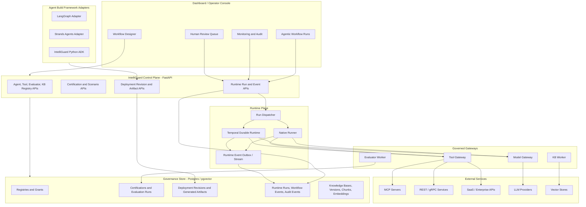
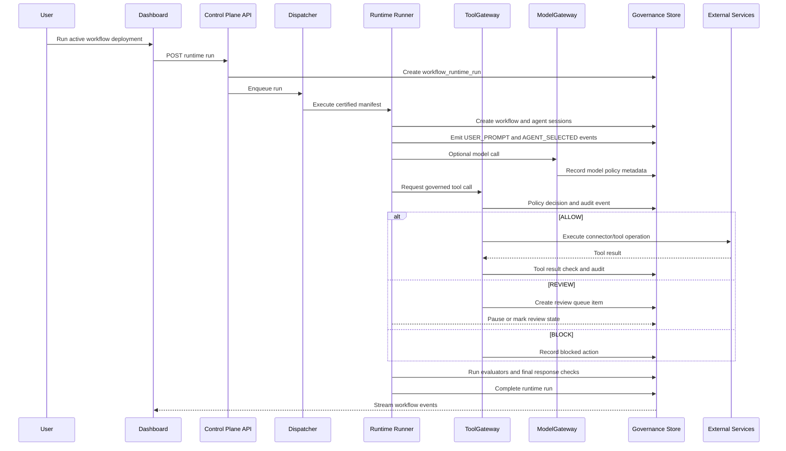
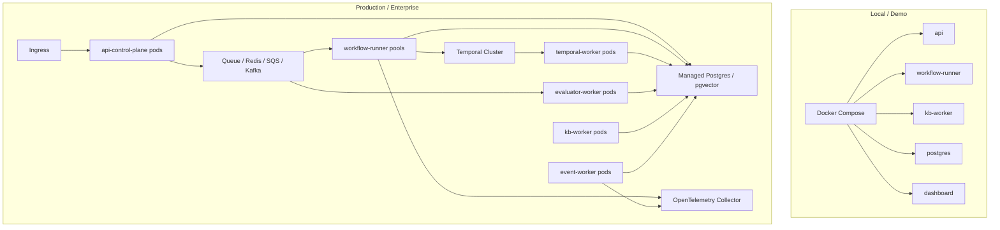

# Production Agent Runtime Foundation Implementation Plan

> **For agentic workers:** REQUIRED SUB-SKILL: Use superpowers:subagent-driven-development (recommended) or superpowers:executing-plans to implement this plan task-by-task. Steps use checkbox (`- [ ]`) syntax for tracking.

**Goal:** Build the production foundation for running real agentic workflows from certified IntelliGuard registrations, with framework-specific agent build adapters, service connectors, durable orchestration, governance enforcement, auditability, and scalable deployment paths.

**Architecture:** IntelliGuard remains the control plane and source of truth. LangGraph and Strands are agent build framework adapters that compile into IntelliGuard runtime manifests. Native and Temporal runtimes execute certified deployment revisions through governed tool and model gateways, while every action emits workflow events, policy decisions, evaluator results, and traces.

**Tech Stack:** Python 3.11+, FastAPI, Pydantic v2, SQLAlchemy 2, PostgreSQL/pgvector, OpenTelemetry, LangGraph, Strands Agents, Temporal Python SDK, Docker Compose, Kubernetes, Pytest, Ruff.

---

## Scope And Principles

This is not an MVP-only plan. Each phase should leave a production-compatible boundary in place, even when the first implementation is simple.

Core principles:

- IntelliGuard manifest is the canonical runtime contract.
- LangGraph and Strands are agent build adapters, not the platform source of truth.
- Temporal is a durable runtime service, not an agent framework.
- MCP, REST, gRPC, databases, SaaS APIs, and internal APIs are service connectors behind a governed tool gateway.
- Real side effects only happen after certification, permission checks, guardrail checks, runtime policy checks, and audit emission.
- Every run has immutable deployment revision metadata: workflow graph hash, agent config hashes, tool config hashes, evaluator config hashes, guardrail policy hash, knowledge base version hashes, model policy, and runtime limits.

## Architecture Views

### Platform Layers



### Workflow Creation To Deployment Lifecycle

```mermaid
flowchart LR
    Draft["User designs workflow graph"] --> Save["Save workflow definition"]
    Save --> Certify["Run workflow certification"]
    Certify --> Gate1{"Certified?"}
    Gate1 -- "No" --> Fix["Fix agents, tools, evaluators, graph, or policies"]
    Fix --> Save
    Gate1 -- "Yes" --> Revision["Create deployment revision"]
    Revision --> Manifest["Compile immutable runtime manifest"]
    Manifest --> Artifacts["Generate runtime artifacts"]
    Artifacts --> Scenario["Run business scenario suite"]
    Scenario --> Gate2{"Scenario gates pass?"}
    Gate2 -- "No" --> Fix
    Gate2 -- "Yes" --> Deploy["Create backend deployment job"]
    Deploy --> Backend{"Deployment backend"}
    Backend --> LocalCompose["Local Docker Compose worker pool"]
    Backend --> Kubernetes["Kubernetes deployment"]
    Backend --> Temporal["Temporal worker fleet"]
    Backend --> Cicd["External CI/CD pipeline"]
    LocalCompose --> Running["Runtime available"]
    Kubernetes --> Running
    Temporal --> Running
    Cicd --> Running
    Running --> Activate["Activate deployment revision"]
    Activate --> Run["Run active deployment"]
    Run --> Trace["Live trace, events, audits, evaluator results"]
```



### Runtime Execution Path



### Deployment And Container Topology



## Target File Structure

Create these new modules:

- `intelliguard/adk/__init__.py`: public ADK exports.
- `intelliguard/adk/manifest.py`: Pydantic manifest schema used by adapters and runtime.
- `intelliguard/adk/client.py`: Python client for registration, certification lookup, and run submission.
- `intelliguard/adk/decorators.py`: `@guarded_agent` and `@guarded_tool` helpers for Python developers.
- `intelliguard/runtime/__init__.py`: runtime package exports.
- `intelliguard/runtime/contracts.py`: runner interfaces, execution request/result models, runtime errors.
- `intelliguard/runtime/manifest_compiler.py`: compiles DB workflow definitions into immutable runtime manifests.
- `intelliguard/runtime/deployment_revisions.py`: creates and reads deployment revision records.
- `intelliguard/runtime/native_runner.py`: first-class runtime extracted from current custom multi-agent logic.
- `intelliguard/runtime/tool_gateway.py`: governed tool invocation path for all runtimes.
- `intelliguard/runtime/model_gateway.py`: model invocation policy wrapper and trace metadata.
- `intelliguard/runtime/dispatcher.py`: async run dispatch abstraction for local queue and production queue.
- `intelliguard/runtime/event_bus.py`: workflow event outbox and live event stream abstraction.
- `intelliguard/runtime/scenario_evaluator.py`: real-world scenario suite execution.
- `intelliguard/runtime/codegen.py`: generates reviewed runtime artifacts from certified manifests.
- `intelliguard/runtime/deployment_orchestrator.py`: creates deployment jobs and hands them to Docker Compose, Kubernetes, or external CI/CD backends.
- `intelliguard/adapters/langgraph.py`: LangGraph build adapter.
- `intelliguard/adapters/strands.py`: Strands build adapter.
- `intelliguard/adapters/http_service.py`: REST/gRPC-style service connector contract.
- `intelliguard/adapters/mcp_service.py`: MCP service connector contract.
- `intelliguard/temporal/workflows.py`: Temporal workflow definitions.
- `intelliguard/temporal/activities.py`: Temporal activities for agent steps, tools, evaluators, and review waits.
- `intelliguard/temporal/worker.py`: Temporal worker entry point.
- `alembic.ini`: Alembic configuration for durable schema migrations.
- `migrations/env.py`: Alembic migration environment using `intelliguard.models.Base.metadata`.
- `migrations/versions/0001_existing_schema_baseline.py`: baseline migration for the current schema.
- `migrations/versions/0002_workflow_runtime_foundation.py`: migration for workflow SDLC, deployment, runtime, connector, scenario, and artifact tables.
- `deploy/k8s/base/*.yaml`: production deployment foundations.
- `dashboard/app/platform/_components/WorkflowDeploymentPanel.tsx`: deployment artifact, job, and activation controls for workflow definitions.
- `dashboard/app/platform/_components/RuntimeRunStatusPanel.tsx`: live runtime run status, event stream, and container/job status display.

Modify these existing modules:

- `intelliguard/models.py`: add workflow SDLC fields, deployment revisions, runtime runs, event outbox, connector records, scenario suites.
- `intelliguard/store.py`: persistence methods for workflow versions, lifecycle transitions, the new tables, and manifest compilation reads.
- `api/main.py`: add workflow version/lifecycle, artifact generation, deployment, run, event stream, deployment job, and scenario endpoints.
- `docker-compose.yml`: add workflow runner, evaluator worker, event worker, optional Temporal services.
- `pyproject.toml`: add optional extras for LangGraph, Strands, Temporal, and production runtime.
- `dashboard/lib/api.ts`: add deployment artifact, deployment job, activation, runtime run, and event APIs.
- `dashboard/app/platform/_components/WorkflowBuilderWorkspace.tsx`: add generate, deploy, activate, and run controls after workflow creation.
- `dashboard/app/platform/_components/WorkflowTraceWorkspace.tsx`: connect agentic workflow traces to deployment/run status.
- `dashboard/app/platform/_components/WorkspaceViewContent.tsx`: route workflow deployment panels into the workflow designer and agentic workflow views.
- `tests/`: add focused tests for manifests, deployment revisions, runners, adapters, connectors, Temporal activities, and production safety rules.

## Data Model Additions

Extend existing `workflow_definitions` records with first-class SDLC fields. The current table already stores the workflow graph and metadata in Postgres; these fields replace metadata-only version tracking with queryable lifecycle state:

- `workflow_root_id`: stable id shared by all versions of the same logical workflow.
- `version`: version label such as `1.0.0` or `v3`.
- `version_number`: monotonic integer within a workflow root.
- `previous_workflow_definition_id`: previous version in the lineage.
- `source_workflow_definition_id`: definition this version was copied from.
- `lifecycle_status`: `DRAFT`, `IN_REVIEW`, `CERTIFIED`, `PACKAGED`, `DEPLOYED`, `ACTIVE`, `RETIRED`, `ARCHIVED`.
- `locked_at`, `locked_by`: set when a definition is certified or packaged and should no longer be edited in place.
- `created_from_deployment_id`: optional rollback/fork source.

Add these tables to `intelliguard/models.py`:

- `workflow_definition_versions`
  - `version_id`, `workflow_root_id`, `workflow_definition_id`, `version`, `version_number`
  - `previous_workflow_definition_id`, `source_workflow_definition_id`
  - `change_summary`, `created_by`, `created_at`

- `workflow_deployment_revisions`
  - `deployment_id`, `workflow_definition_id`, `environment`, `version`, `status`
  - `manifest`, `manifest_hash`, `graph_version_hash`
  - `agent_config_hashes`, `tool_config_hashes`, `evaluator_config_hashes`, `policy_hashes`, `kb_version_hashes`
  - `runtime_type`, `runtime_limits`, `created_by`, `created_at`, `activated_at`, `retired_at`

- `workflow_runtime_runs`
  - `run_id`, `deployment_id`, `workflow_definition_id`, `workflow_id`
  - `environment`, `status`, `decision`, `idempotency_key`
  - `input_payload`, `output_payload`, `runtime_type`, `started_at`, `completed_at`, `error`

- `runtime_event_outbox`
  - `outbox_id`, `run_id`, `workflow_id`, `session_id`, `event_type`
  - `payload`, `status`, `created_at`, `published_at`, `publish_attempts`

- `workflow_generated_artifacts`
  - `artifact_id`, `deployment_id`, `workflow_definition_id`, `artifact_type`, `artifact_name`
  - `content`, `content_hash`, `storage_uri`, `status`, `created_at`
  - supported `artifact_type` values: `runtime_manifest`, `langgraph_module`, `strands_module`, `dockerfile`, `compose_patch`, `k8s_manifest`, `temporal_worker_config`

- `deployment_jobs`
  - `job_id`, `deployment_id`, `environment`, `backend`, `status`, `requested_by`
  - `image_ref`, `worker_pool`, `logs`, `started_at`, `completed_at`, `error`
  - supported `status` values: `PENDING`, `GENERATING_ARTIFACTS`, `BUILDING_IMAGE`, `PUSHING_IMAGE`, `DEPLOYING`, `RUNNING`, `FAILED`, `CANCELLED`

- `service_connectors`
  - `connector_id`, `connector_type`, `display_name`, `environment`, `owner`
  - `base_url`, `auth_type`, `secret_ref`, `allowed_operations`, `timeout_ms`, `metadata`

- `scenario_suites`
  - `suite_id`, `display_name`, `target_type`, `environment`, `cases`, `pass_threshold`, `created_at`, `updated_at`

- `scenario_runs`
  - `scenario_run_id`, `suite_id`, `target_id`, `deployment_id`, `status`, `overall_result`
  - `case_total`, `case_passed`, `started_at`, `completed_at`, `evidence`

## Phase 1: Workflow SDLC, Runtime Contract, And Manifest Foundation

### Task 0: Add Durable Schema Migration Foundation

**Files:**
- Create: `alembic.ini`
- Create: `migrations/env.py`
- Create: `migrations/versions/0001_existing_schema_baseline.py`
- Modify: `pyproject.toml`
- Modify: `intelliguard/db.py`
- Test: `tests/test_schema_migrations.py`

The current database boot path calls `Base.metadata.create_all(engine)` and then `ensure_runtime_schema(engine)`. That works for fresh test databases but does not safely evolve existing databases when tables or columns are added. This task introduces Alembic as the production migration path while keeping `ensure_runtime_schema()` as a conservative local/dev compatibility fallback during the transition.

- [ ] **Step 1: Add Alembic dependency**

Add to `pyproject.toml`:

```toml
dependencies = [
  "alembic>=1.14.0",
]
```

Preserve existing dependencies and ordering.

- [ ] **Step 2: Write migration tests**

Create `tests/test_schema_migrations.py` with tests that:

- Import Alembic configuration.
- Verify every SQLAlchemy table is represented by metadata.
- Run `alembic upgrade head` against an empty test database.
- Run `init_db()` after migration and verify it is idempotent.
- Verify `ensure_runtime_schema()` still adds missing compatibility columns when Alembic has not been run.

- [ ] **Step 3: Add Alembic config**

Create `alembic.ini` pointing `script_location` to `migrations`.

Create `migrations/env.py` that imports `Base.metadata` from `intelliguard.models`, reads `DATABASE_URL`, and supports offline and online migrations.

- [ ] **Step 4: Add baseline migration**

Create `migrations/versions/0001_existing_schema_baseline.py` representing the schema that exists before this production runtime foundation. For existing developer databases, document the baseline command:

```bash
alembic stamp 0001_existing_schema_baseline
```

For new databases, document:

```bash
alembic upgrade head
```

- [ ] **Step 5: Update `init_db()` migration behavior**

Update `intelliguard/db.py` so production deployments can require migrations before startup:

- If `DB_MIGRATIONS_REQUIRED=true`, do not rely on `create_all()` for missing tables.
- Always keep `ensure_runtime_schema(engine)` idempotent for local/dev compatibility.
- Log or raise a clear error when required migration tables are missing.

- [ ] **Step 6: Add schema migration rule to future schema tasks**

Document in this plan and code comments: every task that changes tables or columns must add both:

- An Alembic revision.
- A matching `ensure_runtime_schema()` fallback using conditional `CREATE TABLE IF NOT EXISTS` or `ALTER TABLE ... ADD COLUMN IF NOT EXISTS` semantics.

- [ ] **Step 7: Run tests**

Run:

```bash
pytest tests/test_schema_migrations.py -v
```

Expected: PASS.

- [ ] **Step 8: Commit**

Run:

```bash
git add alembic.ini migrations pyproject.toml intelliguard/db.py tests/test_schema_migrations.py
git commit -m "chore: add durable schema migration foundation"
```

### Task 1: Add Runtime Manifest Schema

**Files:**
- Create: `intelliguard/adk/__init__.py`
- Create: `intelliguard/adk/manifest.py`
- Test: `tests/test_runtime_manifest.py`

- [ ] **Step 1: Write manifest tests**

Create `tests/test_runtime_manifest.py` with tests that validate a minimal certified workflow manifest, reject missing runtime limits, and produce a stable hash.

```python
from intelliguard.adk.manifest import RuntimeManifest


def _manifest_payload() -> dict:
    return {
        "manifest_version": "1.0",
        "workflow_definition_id": "customer-support-workflow",
        "deployment_id": "dep_123",
        "environment": "pre_prod",
        "runtime_type": "native",
        "graph_version_hash": "graph123",
        "nodes": [
            {
                "node_id": "lead",
                "agent_id": "support-lead",
                "node_type": "lead_agent",
                "allowed_tools": [],
                "runtime": {"framework": "native"},
            }
        ],
        "edges": [],
        "policy_snapshots": {"support-lead": "policy123"},
        "tool_snapshots": {},
        "evaluator_snapshots": {},
        "knowledge_snapshots": {},
        "runtime_limits": {
            "timeout_seconds": 300,
            "max_parallel_nodes": 4,
            "max_tool_calls": 30,
            "max_llm_calls": 20,
            "max_cost_usd": 5.0,
        },
    }


def test_runtime_manifest_accepts_certified_payload():
    manifest = RuntimeManifest.model_validate(_manifest_payload())

    assert manifest.workflow_definition_id == "customer-support-workflow"
    assert manifest.runtime_limits.max_parallel_nodes == 4


def test_runtime_manifest_requires_runtime_limits():
    payload = _manifest_payload()
    payload.pop("runtime_limits")

    try:
        RuntimeManifest.model_validate(payload)
    except Exception as exc:
        assert "runtime_limits" in str(exc)
    else:
        raise AssertionError("runtime limits must be required")


def test_runtime_manifest_hash_is_stable():
    first = RuntimeManifest.model_validate(_manifest_payload())
    second = RuntimeManifest.model_validate(_manifest_payload())

    assert first.manifest_hash() == second.manifest_hash()


def test_runtime_manifest_hash_includes_node_metadata_but_excludes_top_level_metadata():
    first_payload = _manifest_payload()
    second_payload = _manifest_payload()
    second_payload["metadata"] = {"generated_at": "different"}

    first = RuntimeManifest.model_validate(first_payload)
    second = RuntimeManifest.model_validate(second_payload)

    assert first.manifest_hash() == second.manifest_hash()

    second_payload["nodes"][0]["metadata"] = {"contract_affecting": True}
    changed = RuntimeManifest.model_validate(second_payload)

    assert first.manifest_hash() != changed.manifest_hash()
```

- [ ] **Step 2: Run failing tests**

Run: `pytest tests/test_runtime_manifest.py -v`

Expected: FAIL because `intelliguard.adk.manifest` does not exist.

- [ ] **Step 3: Implement manifest schema**

Create `intelliguard/adk/manifest.py` with Pydantic models:

```python
from __future__ import annotations

import hashlib
import json
from typing import Any, Literal

from pydantic import BaseModel, Field


RuntimeType = Literal["native", "langgraph", "strands", "temporal"]


class RuntimeLimits(BaseModel):
    timeout_seconds: int = Field(gt=0, le=86_400)
    max_parallel_nodes: int = Field(gt=0, le=128)
    max_tool_calls: int = Field(gt=0, le=10_000)
    max_llm_calls: int = Field(gt=0, le=10_000)
    max_cost_usd: float = Field(ge=0)


class RuntimeNode(BaseModel):
    node_id: str
    agent_id: str
    node_type: str
    allowed_tools: list[str] = Field(default_factory=list)
    runtime: dict[str, Any] = Field(default_factory=dict)
    metadata: dict[str, Any] = Field(default_factory=dict)


class RuntimeEdge(BaseModel):
    edge_id: str
    from_node_id: str
    to_node_id: str
    conditions: dict[str, Any] = Field(default_factory=dict)


class RuntimeManifest(BaseModel):
    manifest_version: str
    workflow_definition_id: str
    deployment_id: str
    environment: str
    runtime_type: RuntimeType
    graph_version_hash: str
    nodes: list[RuntimeNode]
    edges: list[RuntimeEdge]
    policy_snapshots: dict[str, str]
    tool_snapshots: dict[str, str]
    evaluator_snapshots: dict[str, str]
    knowledge_snapshots: dict[str, str]
    runtime_limits: RuntimeLimits
    metadata: dict[str, Any] = Field(default_factory=dict)

    def manifest_hash(self) -> str:
        # Top-level metadata is operational provenance and does not affect runtime identity.
        # Node metadata is part of the deployable node contract and remains hash-affecting.
        payload = self.model_dump(mode="json", exclude={"metadata"})
        encoded = json.dumps(payload, sort_keys=True, separators=(",", ":")).encode("utf-8")
        return hashlib.sha256(encoded).hexdigest()[:24]
```

Create `intelliguard/adk/__init__.py`:

```python
from intelliguard.adk.manifest import RuntimeManifest, RuntimeLimits

__all__ = ["RuntimeManifest", "RuntimeLimits"]
```

- [ ] **Step 4: Run tests**

Run: `pytest tests/test_runtime_manifest.py -v`

Expected: PASS.

- [ ] **Step 5: Commit**

Run:

```bash
git add intelliguard/adk tests/test_runtime_manifest.py
git commit -m "feat: add runtime manifest schema"
```

### Task 2: Add Workflow Definition SDLC And Versioning

**Files:**
- Modify: `intelliguard/models.py`
- Modify: `intelliguard/store.py`
- Modify: `api/main.py`
- Modify: `dashboard/app/platform/_components/WorkflowBuilderWorkspace.tsx`
- Test: `tests/test_workflow_sdlc.py`

Workflow definitions are stored in Postgres in the existing `workflow_definitions` table. This task makes lifecycle and lineage first-class instead of relying only on `metadata.workflow_root_id`, `metadata.workflow_version`, and `metadata.previous_workflow_definition_id`.

- [ ] **Step 1: Run GitNexus impact analysis before editing symbols**

Run impact analysis for symbols that will be edited:

```text
gitnexus_impact(target="WorkflowDefinition", direction="upstream", repo="intelliguard", file_path="intelliguard/models.py")
gitnexus_impact(target="upsert_workflow_definition", direction="upstream", repo="intelliguard")
```

If the risk is HIGH or CRITICAL, report the blast radius before editing.

- [ ] **Step 2: Write workflow SDLC tests**

Create `tests/test_workflow_sdlc.py` with tests for:

- New workflow definitions default to `DRAFT`.
- A new version receives the same `workflow_root_id` and increments `version_number`.
- Certified or packaged workflow definitions cannot be edited in place.
- Editing a locked workflow requires creating a new version.
- Lifecycle transitions reject invalid moves, such as `DRAFT` directly to `ACTIVE`.
- Rollback activation can reactivate a previous deployment revision without mutating the workflow definition.

- [ ] **Step 3: Run failing tests**

Run: `pytest tests/test_workflow_sdlc.py -v`

Expected: FAIL because lifecycle fields and methods do not exist.

- [ ] **Step 4: Add workflow SDLC fields**

Add these fields to `WorkflowDefinition` in `intelliguard/models.py`:

```python
workflow_root_id: Mapped[str | None] = mapped_column(String(120))
version: Mapped[str] = mapped_column(String(40), default="v1")
version_number: Mapped[int] = mapped_column(Integer, default=1)
previous_workflow_definition_id: Mapped[str | None] = mapped_column(String(120))
source_workflow_definition_id: Mapped[str | None] = mapped_column(String(120))
lifecycle_status: Mapped[str] = mapped_column(String(40), default="DRAFT")
locked_at: Mapped[datetime | None] = mapped_column(DateTime(timezone=True))
locked_by: Mapped[str | None] = mapped_column(String(160))
created_from_deployment_id: Mapped[str | None] = mapped_column(String(64))
```

Add `WorkflowDefinitionVersion` using the fields listed in "Data Model Additions".

Keep `previous_workflow_definition_id`, `source_workflow_definition_id`, and `created_from_deployment_id` as string references rather than hard database foreign keys. This matches the existing codebase style for workflow/session references and allows archived historical lineage to remain readable even when related records are moved or exported. Enforce existence in store methods.

- [ ] **Step 5: Add migration coverage**

Create an Alembic revision or extend `0002_workflow_runtime_foundation.py` with:

- `ALTER TABLE workflow_definitions ADD COLUMN IF NOT EXISTS workflow_root_id VARCHAR(120)`
- `ALTER TABLE workflow_definitions ADD COLUMN IF NOT EXISTS version VARCHAR(40) NOT NULL DEFAULT 'v1'`
- `ALTER TABLE workflow_definitions ADD COLUMN IF NOT EXISTS version_number INTEGER NOT NULL DEFAULT 1`
- `ALTER TABLE workflow_definitions ADD COLUMN IF NOT EXISTS previous_workflow_definition_id VARCHAR(120)`
- `ALTER TABLE workflow_definitions ADD COLUMN IF NOT EXISTS source_workflow_definition_id VARCHAR(120)`
- `ALTER TABLE workflow_definitions ADD COLUMN IF NOT EXISTS lifecycle_status VARCHAR(40) NOT NULL DEFAULT 'DRAFT'`
- `ALTER TABLE workflow_definitions ADD COLUMN IF NOT EXISTS locked_at TIMESTAMP WITH TIME ZONE`
- `ALTER TABLE workflow_definitions ADD COLUMN IF NOT EXISTS locked_by VARCHAR(160)`
- `ALTER TABLE workflow_definitions ADD COLUMN IF NOT EXISTS created_from_deployment_id VARCHAR(64)`
- `CREATE TABLE IF NOT EXISTS workflow_definition_versions` with the columns listed in "Data Model Additions"

Update `ensure_runtime_schema()` in `intelliguard/db.py` with matching conditional `ALTER TABLE` and `CREATE TABLE IF NOT EXISTS` fallback logic.

- [ ] **Step 6: Add store methods**

Add these methods to `GovernanceStore`:

```python
def create_workflow_definition_version(
    self,
    source_workflow_definition_id: str,
    *,
    new_workflow_definition_id: str,
    version: str,
    change_summary: str,
    created_by: str,
) -> dict[str, Any]:
    raise NotImplementedError

def transition_workflow_lifecycle(
    self,
    workflow_definition_id: str,
    *,
    target_status: str,
    actor: str,
) -> dict[str, Any]:
    raise NotImplementedError

def list_workflow_definition_versions(self, workflow_root_id: str) -> list[dict[str, Any]]:
    raise NotImplementedError
```

Allowed transitions:

- `DRAFT -> IN_REVIEW`
- `IN_REVIEW -> CERTIFIED`
- `IN_REVIEW -> DRAFT`
- `CERTIFIED -> PACKAGED`
- `PACKAGED -> DEPLOYED`
- `DEPLOYED -> ACTIVE`
- `ACTIVE -> RETIRED`
- non-active and non-retired statuses -> `ARCHIVED`
- `RETIRED -> ARCHIVED`

Do not allow `ACTIVE -> ARCHIVED`; active workflows must transition to `RETIRED` first.

- [ ] **Step 7: Enforce no in-place edits after lock**

Update `upsert_workflow_definition` so if an existing definition has `locked_at` or lifecycle status in `CERTIFIED`, `PACKAGED`, `DEPLOYED`, `ACTIVE`, `RETIRED`, or `ARCHIVED`, it raises a clear error:

```python
raise ValueError("Locked workflow definitions cannot be edited in place. Create a new version.")
```

- [ ] **Step 8: Add API endpoints**

Add:

- `GET /v1/workflow-definitions/{workflow_definition_id}/versions`
- `POST /v1/workflow-definitions/{workflow_definition_id}/versions`
- `POST /v1/workflow-definitions/{workflow_definition_id}/lifecycle`

The version endpoint should accept `new_workflow_definition_id`, `version`, and `change_summary`.

- [ ] **Step 9: Update frontend version workflow**

Update `WorkflowBuilderWorkspace.tsx` to use the version endpoint instead of only writing version lineage into metadata. Keep metadata values for backward compatibility in records created before this task.

- [ ] **Step 10: Run tests**

Run:

```bash
pytest tests/test_workflow_sdlc.py tests/test_store_governance.py -v
```

Expected: PASS.

- [ ] **Step 11: Commit**

Run:

```bash
git add intelliguard/models.py intelliguard/store.py api/main.py dashboard/app/platform/_components/WorkflowBuilderWorkspace.tsx tests/test_workflow_sdlc.py
git commit -m "feat: add workflow definition SDLC versioning"
```

### Task 3: Add Deployment Revision Persistence

**Files:**
- Modify: `intelliguard/models.py`
- Modify: `intelliguard/store.py`
- Test: `tests/test_deployment_revisions.py`

- [ ] **Step 1: Run GitNexus impact analysis before editing symbols**

Run impact analysis for symbols that will be edited:

```text
gitnexus_impact(target="Base", direction="upstream", repo="intelliguard")
gitnexus_impact(target="GovernanceStore", direction="upstream", repo="intelliguard")
```

If the risk is HIGH or CRITICAL, report the blast radius before editing.

- [ ] **Step 2: Write deployment revision tests**

Create tests that create a deployment revision, fetch the active revision, retire it, and verify immutable manifest hashes do not change.

Run: `pytest tests/test_deployment_revisions.py -v`

Expected: FAIL because the store methods do not exist.

- [ ] **Step 3: Add SQLAlchemy models**

Add `WorkflowDeploymentRevision`, `WorkflowRuntimeRun`, `RuntimeEventOutbox`, `ServiceConnector`, `ScenarioSuite`, and `ScenarioRun` to `intelliguard/models.py` using the columns listed in "Data Model Additions".

- [ ] **Step 4: Add migration coverage**

Extend the Alembic production runtime revision and `ensure_runtime_schema()` fallback with conditional table creation for:

- `workflow_deployment_revisions`
- `workflow_runtime_runs`
- `runtime_event_outbox`
- `service_connectors`
- `scenario_suites`
- `scenario_runs`

The migration must be safe on existing databases and must not depend on `Base.metadata.create_all()` for production.

- [ ] **Step 5: Add store methods**

Add these methods to `GovernanceStore` in `intelliguard/store.py`:

```python
def create_workflow_deployment_revision(self, payload: dict[str, Any]) -> dict[str, Any]:
    raise NotImplementedError
def get_workflow_deployment_revision(self, deployment_id: str) -> dict[str, Any] | None:
    raise NotImplementedError
def get_active_workflow_deployment(self, workflow_definition_id: str, environment: str) -> dict[str, Any] | None:
    raise NotImplementedError
def activate_workflow_deployment(self, deployment_id: str) -> dict[str, Any]:
    raise NotImplementedError
def retire_workflow_deployment(self, deployment_id: str) -> dict[str, Any]:
    raise NotImplementedError
def create_workflow_runtime_run(self, payload: dict[str, Any]) -> dict[str, Any]:
    raise NotImplementedError
def update_workflow_runtime_run(self, run_id: str, payload: dict[str, Any]) -> dict[str, Any]:
    raise NotImplementedError
def add_runtime_outbox_event(self, payload: dict[str, Any]) -> dict[str, Any]:
    raise NotImplementedError
```

- [ ] **Step 6: Run persistence tests**

Run: `pytest tests/test_deployment_revisions.py -v`

Expected: PASS.

- [ ] **Step 7: Run related regression tests**

Run: `pytest tests/test_store_governance.py tests/test_monitoring.py -v`

Expected: PASS.

- [ ] **Step 8: Commit**

Run:

```bash
git add intelliguard/models.py intelliguard/store.py tests/test_deployment_revisions.py
git commit -m "feat: persist workflow deployment revisions"
```

### Task 4: Compile Certified Workflow Definitions Into Runtime Manifests

**Files:**
- Create: `intelliguard/runtime/manifest_compiler.py`
- Create: `intelliguard/runtime/__init__.py`
- Modify: `api/main.py`
- Test: `tests/test_manifest_compiler.py`

- [ ] **Step 1: Write compiler tests**

Test cases:

- Certified workflow compiles into `RuntimeManifest`.
- Uncertified workflow raises `ManifestCompileError`.
- Manifest includes agent, tool, evaluator, guardrail, and knowledge hashes.
- Knowledge snapshots are derived from published `KnowledgeBaseVersion` records assigned to workflow agents.
- Workflows with a null legacy `graph_version_hash` compile by recomputing the hash from normalized nodes and edges.
- Changing a workflow edge changes the manifest hash.

- [ ] **Step 2: Run failing tests**

Run: `pytest tests/test_manifest_compiler.py -v`

Expected: FAIL because compiler module does not exist.

- [ ] **Step 3: Add snapshot derivation helpers**

Add helper methods in `GovernanceStore` or `manifest_compiler.py`:

```python
def compute_kb_version_snapshot(version: dict[str, Any]) -> str:
    payload = {
        "version_id": version["version_id"],
        "kb_id": version["kb_id"],
        "version": version["version"],
        "status": version["status"],
        "profile": version.get("profile") or {},
        "file_manifest": version.get("file_manifest") or [],
        "retrieval_mode": version.get("retrieval_mode"),
        "vector_backend": version.get("vector_backend"),
        "embedding_model": version.get("embedding_model"),
        "chunking_strategy": version.get("chunking_strategy"),
        "chunk_size": version.get("chunk_size"),
        "chunk_overlap": version.get("chunk_overlap"),
        "index_version_id": version.get("index_version_id"),
    }
    encoded = json.dumps(payload, sort_keys=True, separators=(",", ":")).encode("utf-8")
    return hashlib.sha256(encoded).hexdigest()[:24]
```

Snapshot rules:

- Use only `published` knowledge base versions for production deployments.
- Include `index_version_id` so re-indexing changes the snapshot.
- For agent-scoped KB assignments, include only KBs assigned to agents in the workflow graph.
- For domain/shared KBs, include only KBs attached to the workflow domain/environment.

- [ ] **Step 4: Implement compiler**

Create `intelliguard/runtime/manifest_compiler.py` with:

```python
from __future__ import annotations

from dataclasses import dataclass
from typing import Any

from intelliguard.adk.manifest import RuntimeManifest
from intelliguard.workflow_graph import workflow_graph_hash


class ManifestCompileError(ValueError):
    pass


@dataclass(frozen=True)
class ManifestCompileOptions:
    runtime_type: str = "native"
    timeout_seconds: int = 300
    max_parallel_nodes: int = 4
    max_tool_calls: int = 30
    max_llm_calls: int = 20
    max_cost_usd: float = 5.0


def compile_workflow_manifest(
    *,
    workflow: dict[str, Any],
    certification: dict[str, Any],
    deployment_id: str,
    snapshots: dict[str, dict[str, str]],
    options: ManifestCompileOptions | None = None,
) -> RuntimeManifest:
    options = options or ManifestCompileOptions()
    if certification.get("status") != "CERTIFIED":
        raise ManifestCompileError("Workflow must be certified before deployment.")
    return RuntimeManifest.model_validate(
        {
            "manifest_version": "1.0",
            "workflow_definition_id": workflow["workflow_definition_id"],
            "deployment_id": deployment_id,
            "environment": workflow["environment"],
            "runtime_type": options.runtime_type,
            "graph_version_hash": workflow.get("graph_version_hash")
            or workflow_graph_hash(workflow.get("nodes") or [], workflow.get("edges") or []),
            "nodes": workflow.get("nodes") or [],
            "edges": workflow.get("edges") or [],
            "policy_snapshots": snapshots.get("policies", {}),
            "tool_snapshots": snapshots.get("tools", {}),
            "evaluator_snapshots": snapshots.get("evaluators", {}),
            "knowledge_snapshots": snapshots.get("knowledge", {}),
            "runtime_limits": {
                "timeout_seconds": options.timeout_seconds,
                "max_parallel_nodes": options.max_parallel_nodes,
                "max_tool_calls": options.max_tool_calls,
                "max_llm_calls": options.max_llm_calls,
                "max_cost_usd": options.max_cost_usd,
            },
            "metadata": {"source": "intelliguard-control-plane"},
        }
    )
```

- [ ] **Step 5: Add deployment endpoint**

Add `POST /v1/workflow-definitions/{workflow_definition_id}/deployments` in `api/main.py`.

Behavior:

- Require `workflow:deploy`.
- Fetch workflow definition and workflow certification.
- Compile manifest.
- Persist deployment revision.
- Return deployment id, manifest hash, status, runtime type, and graph hash.

- [ ] **Step 6: Run tests**

Run: `pytest tests/test_manifest_compiler.py -v`

Expected: PASS.

- [ ] **Step 7: Commit**

Run:

```bash
git add intelliguard/runtime api/main.py tests/test_manifest_compiler.py
git commit -m "feat: compile certified workflow manifests"
```

## Phase 2: Runtime Execution Core

### Task 5: Add Runtime Runner Interface

**Files:**
- Create: `intelliguard/runtime/contracts.py`
- Test: `tests/test_runtime_contracts.py`

- [ ] **Step 1: Write contract tests**

Verify that all runners return a common `RuntimeExecutionResult` and expose `supports(runtime_type)`.

- [ ] **Step 2: Implement contracts**

Create:

```python
from __future__ import annotations

from dataclasses import dataclass, field
from typing import Any, Protocol

from intelliguard.adk.manifest import RuntimeManifest


@dataclass(frozen=True)
class RuntimeExecutionRequest:
    run_id: str
    manifest: RuntimeManifest
    user_query: str
    input_payload: dict[str, Any] = field(default_factory=dict)
    idempotency_key: str | None = None


@dataclass(frozen=True)
class RuntimeExecutionResult:
    run_id: str
    workflow_id: str
    decision: str
    status: str
    summary: str
    output_payload: dict[str, Any] = field(default_factory=dict)


class RuntimeRunner(Protocol):
    runtime_type: str

    def execute(self, request: RuntimeExecutionRequest) -> RuntimeExecutionResult:
        raise NotImplementedError
```

`RuntimeExecutionRequest.idempotency_key` is authoritative for run submission. The dispatcher must persist it on `workflow_runtime_runs` and reject duplicate active run submissions before a runner starts. Tool-level idempotency is handled separately by `ToolGatewayRequest.idempotency_key`.

- [ ] **Step 3: Run tests**

Run: `pytest tests/test_runtime_contracts.py -v`

Expected: PASS.

- [ ] **Step 4: Commit**

Run:

```bash
git add intelliguard/runtime/contracts.py tests/test_runtime_contracts.py
git commit -m "feat: define workflow runtime contracts"
```

### Task 6: Extract Native Runner From Current Multi-Agent Runtime

**Files:**
- Create: `intelliguard/runtime/native_runner.py`
- Modify: `intelliguard/multi_agent.py`
- Modify: `api/main.py`
- Test: `tests/test_native_runtime_runner.py`
- Test: `tests/test_runner_guardrails.py`

- [ ] **Step 1: Run impact analysis**

Run:

```text
gitnexus_impact(target="run_customer_support_workflow", direction="upstream", repo="intelliguard")
gitnexus_impact(target="_run_customer_support_workflow_impl", direction="upstream", repo="intelliguard")
```

Report HIGH or CRITICAL risk before editing.

- [ ] **Step 2: Write native runner tests**

Test that `NativeRuntimeRunner.execute()`:

- Creates a workflow run.
- Executes selected steps.
- Calls `GovernedToolRunner`.
- Records workflow events.
- Runs workflow evaluators.
- Returns `RuntimeExecutionResult`.

- [ ] **Step 3: Implement wrapper first**

Implement `NativeRuntimeRunner` as a wrapper around existing `run_customer_support_workflow` so behavior remains unchanged.

- [ ] **Step 4: Switch `/v1/multi-agent-runs` to use deployment revision when supplied**

Accept either:

- `workflow_definition_id` for backward compatibility.
- `deployment_id` for production runs.

When `deployment_id` is present, load the immutable manifest and run through `NativeRuntimeRunner`.

- [ ] **Step 5: Run regression tests**

Run:

```bash
pytest tests/test_runner_guardrails.py tests/test_native_runtime_runner.py tests/test_monitoring.py -v
```

Expected: PASS.

- [ ] **Step 6: Commit**

Run:

```bash
git add intelliguard/runtime/native_runner.py intelliguard/multi_agent.py api/main.py tests/test_native_runtime_runner.py
git commit -m "feat: execute workflow deployments with native runner"
```

### Task 7: Centralize Tool Execution Through Tool Gateway

**Files:**
- Create: `intelliguard/runtime/tool_gateway.py`
- Modify: `intelliguard/runner.py`
- Modify: `intelliguard/tools.py`
- Test: `tests/test_tool_gateway.py`

- [ ] **Step 1: Run impact analysis**

Run:

```text
gitnexus_impact(target="GovernedToolRunner", direction="upstream", repo="intelliguard")
gitnexus_impact(target="ToolRegistry", direction="upstream", repo="intelliguard")
```

- [ ] **Step 2: Write gateway tests**

Verify:

- All tool calls require an agent identity.
- All tool calls emit pre-tool governance decisions.
- Write tools require side-effect controls.
- Connector failures return structured runtime errors and audit events.
- Idempotency key prevents duplicate write tool execution.

- [ ] **Step 3: Thread idempotency through `GovernedToolRunner`**

Update `GovernedToolRunner.evaluate_tool_call()` and `GovernedToolRunner.call_tool()` in `intelliguard/runner.py` to accept:

```python
idempotency_key: str | None = None
```

Add store methods:

```python
def get_tool_call_by_idempotency_key(self, agent_id: str, tool_name: str, idempotency_key: str) -> dict[str, Any] | None:
    raise NotImplementedError
def record_tool_idempotency_key(self, tool_call_id: str, idempotency_key: str) -> None:
    raise NotImplementedError
```

For write-capable tools, `call_tool()` must check the idempotency key before executing the tool. If a completed call exists for the same `agent_id`, `tool_name`, and `idempotency_key`, return the prior decision/result summary without executing the tool again. If a conflicting in-flight call exists, return a structured `REVIEW` or retryable conflict response and emit an audit event.

- [ ] **Step 4: Implement gateway**

Create:

```python
from __future__ import annotations

from dataclasses import dataclass
from typing import Any

from intelliguard.runner import GovernedToolResult, GovernedToolRunner


@dataclass(frozen=True)
class ToolGatewayRequest:
    agent_id: str
    session_id: str
    user_query: str
    tool_name: str
    tool_args: dict[str, Any]
    idempotency_key: str | None = None


class ToolGateway:
    def __init__(self, runner_factory) -> None:
        self._runner_factory = runner_factory

    def invoke(self, request: ToolGatewayRequest) -> GovernedToolResult:
        runner: GovernedToolRunner = self._runner_factory(request.agent_id)
        return runner.call_tool(
            session_id=request.session_id,
            user_query=request.user_query,
            tool_name=request.tool_name,
            tool_args=request.tool_args,
            idempotency_key=request.idempotency_key,
        )
```

- [ ] **Step 5: Add migration coverage**

Add idempotency persistence to the schema through Alembic and `ensure_runtime_schema()` fallback. Use either:

- `tool_calls.idempotency_key` plus a unique index on `(agent_id, tool_name, idempotency_key)` where `idempotency_key IS NOT NULL`, or
- a separate `tool_call_idempotency_keys` table with `agent_id`, `tool_name`, `idempotency_key`, and `tool_call_id`.

- [ ] **Step 6: Route native runtime through tool gateway**

Update the native runtime so no runtime directly reads `ToolRegistry.get()` except through the gateway.

- [ ] **Step 7: Run tests**

Run: `pytest tests/test_tool_gateway.py tests/test_runner_guardrails.py -v`

Expected: PASS.

- [ ] **Step 8: Commit**

Run:

```bash
git add intelliguard/runtime/tool_gateway.py intelliguard/runner.py intelliguard/tools.py tests/test_tool_gateway.py
git commit -m "feat: centralize governed tool execution"
```

## Phase 3: Agent Build Framework Adapters

### Task 8: Add LangGraph Build Adapter

**Files:**
- Modify: `pyproject.toml`
- Create: `intelliguard/adapters/__init__.py`
- Create: `intelliguard/adapters/langgraph.py`
- Test: `tests/test_langgraph_adapter.py`

- [ ] **Step 1: Add optional dependency extra**

Add to `pyproject.toml`:

```toml
[project.optional-dependencies]
langgraph = [
  "langgraph>=0.2.0",
]
```

Preserve the existing `dev` extra.

- [ ] **Step 2: Write adapter tests**

Tests:

- Compile an IntelliGuard manifest into a LangGraph graph.
- Each node uses the tool gateway for tool execution.
- Graph state includes `run_id`, `workflow_id`, `session_id`, `decision`, `findings`, and `output`.
- Conditional edges respect manifest edge conditions.

- [ ] **Step 3: Implement adapter boundary**

Implement `LangGraphBuildAdapter` with:

```python
class LangGraphBuildAdapter:
    framework = "langgraph"

    def build(self, manifest: RuntimeManifest):
        raise NotImplementedError
```

Keep LangGraph imports inside the method so the base package does not require LangGraph unless the extra is installed.

- [ ] **Step 4: Add runtime type support**

Register `runtime_type="langgraph"` in runtime runner selection.

- [ ] **Step 5: Run tests**

Run:

```bash
pytest tests/test_langgraph_adapter.py tests/test_runtime_manifest.py -v
```

Expected: PASS when `langgraph` extra is installed; skip adapter tests with a clear message when it is not installed.

- [ ] **Step 6: Commit**

Run:

```bash
git add pyproject.toml intelliguard/adapters tests/test_langgraph_adapter.py
git commit -m "feat: add LangGraph build adapter"
```

### Task 9: Add Strands Build Adapter

**Files:**
- Modify: `pyproject.toml`
- Create: `intelliguard/adapters/strands.py`
- Test: `tests/test_strands_adapter.py`

- [ ] **Step 1: Add optional dependency extra**

Add:

```toml
strands = [
  "strands-agents>=1.0.0",
]
```

- [ ] **Step 2: Write adapter tests**

Tests:

- Import a Strands-style agent definition into IntelliGuard agent metadata.
- Map Strands tools to IntelliGuard tool records.
- Wrap tool calls through `ToolGateway`.
- Emit OpenTelemetry attributes compatible with existing telemetry keys.

- [ ] **Step 3: Implement adapter**

Implement `StrandsBuildAdapter` with methods:

```python
class StrandsBuildAdapter:
    framework = "strands"

    def agent_to_registration_payload(self, agent: object) -> dict[str, object]:
        raise NotImplementedError

    def tool_to_registration_payload(self, tool: object) -> dict[str, object]:
        raise NotImplementedError

    def build(self, manifest: RuntimeManifest):
        raise NotImplementedError
```

Keep Strands imports lazy inside methods.

- [ ] **Step 4: Run tests**

Run: `pytest tests/test_strands_adapter.py -v`

Expected: PASS when Strands is installed; skip with a clear message when it is not installed.

- [ ] **Step 5: Commit**

Run:

```bash
git add pyproject.toml intelliguard/adapters/strands.py tests/test_strands_adapter.py
git commit -m "feat: add Strands build adapter"
```

## Phase 4: Service Connectors And Model Gateway

### Task 10: Add Service Connector Contracts

**Files:**
- Create: `intelliguard/adapters/http_service.py`
- Create: `intelliguard/adapters/mcp_service.py`
- Modify: `api/main.py`
- Test: `tests/test_service_connectors.py`

- [ ] **Step 1: Write connector tests**

Verify:

- Connector registration requires environment and owner.
- Connector operations are allow-listed.
- Secrets are stored by reference only.
- Tool records can reference a connector operation.
- Connector execution is blocked if operation is not allow-listed.

- [ ] **Step 2: Implement HTTP connector**

Create an `HttpServiceConnector` that receives a connector record and operation payload, validates operation allow-list, applies timeout, and returns structured result metadata.

- [ ] **Step 3: Implement MCP connector contract**

Create an `McpServiceConnector` interface that maps MCP server name and tool name to IntelliGuard tool execution records.

- [ ] **Step 4: Add API endpoints**

Add:

- `GET /v1/service-connectors`
- `POST /v1/service-connectors`
- `GET /v1/service-connectors/{connector_id}`
- `POST /v1/service-connectors/{connector_id}/test`

- [ ] **Step 5: Run tests**

Run: `pytest tests/test_service_connectors.py -v`

Expected: PASS.

- [ ] **Step 6: Commit**

Run:

```bash
git add intelliguard/adapters api/main.py tests/test_service_connectors.py
git commit -m "feat: add governed service connectors"
```

### Task 11: Add Model Gateway

**Files:**
- Create: `intelliguard/runtime/model_gateway.py`
- Modify: `intelliguard/store.py`
- Test: `tests/test_model_gateway.py`

- [ ] **Step 1: Write model gateway tests**

Verify:

- Model request records provider, model, input classification, redaction mode, latency, token estimate, and cost estimate in workflow events and runtime outbox payloads.
- Sensitive environments block unapproved model providers.
- Model requests emit workflow events and OpenTelemetry attributes.

- [ ] **Step 2: Implement model gateway request/result models**

Create typed dataclasses for model request and result.

- [ ] **Step 3: Add provider policy checks**

Initial policy source: manifest metadata and guardrail policy config. Enforce allowed providers and allowed data classifications.

- [ ] **Step 4: Keep model gateway schema-free in this phase**

Do not add a `model_invocations` table in this task. Persist model metadata through existing/planned `workflow_events` and `runtime_event_outbox` records. If a later analytics feature needs a first-class model invocation table, add it through Alembic and `ensure_runtime_schema()` as a separate schema task.

- [ ] **Step 5: Run tests**

Run: `pytest tests/test_model_gateway.py -v`

Expected: PASS.

- [ ] **Step 6: Commit**

Run:

```bash
git add intelliguard/runtime/model_gateway.py intelliguard/store.py tests/test_model_gateway.py
git commit -m "feat: add governed model gateway"
```

## Phase 5: Async Dispatch, Events, And Runtime Workers

### Task 12: Add Run Dispatcher

**Files:**
- Create: `intelliguard/runtime/dispatcher.py`
- Create: `intelliguard/runtime/worker.py`
- Modify: `api/main.py`
- Modify: `docker-compose.yml`
- Test: `tests/test_runtime_dispatcher.py`

- [ ] **Step 1: Write dispatcher tests**

Verify:

- API creates a runtime run record and enqueues it.
- Dispatcher respects idempotency key.
- Worker updates run status to `RUNNING`, `COMPLETED`, `FAILED`, `BLOCKED`, or `REVIEW`.
- API does not block while long workflow runs execute.

- [ ] **Step 2: Implement local dispatcher**

Start with Postgres-backed polling or in-process queue for local Docker. Keep the interface compatible with Redis/SQS/Kafka.

- [ ] **Step 3: Implement run-level idempotency**

Use `workflow_runtime_runs.idempotency_key` created in Task 3. The dispatcher must:

- Reject duplicate active submissions for the same deployment id and idempotency key.
- Return the existing completed run when the same idempotency key is retried after completion.
- Never start two workers for the same active idempotency key.

- [ ] **Step 4: Add runner service**

Add a `workflow-runner` service to `docker-compose.yml` using:

```yaml
workflow-runner:
  build:
    context: .
    dockerfile: Dockerfile.api
  command: ["python", "-m", "intelliguard.runtime.worker"]
```

- [ ] **Step 5: Run tests**

Run: `pytest tests/test_runtime_dispatcher.py -v`

Expected: PASS.

- [ ] **Step 6: Commit**

Run:

```bash
git add intelliguard/runtime/dispatcher.py intelliguard/runtime/worker.py api/main.py docker-compose.yml tests/test_runtime_dispatcher.py
git commit -m "feat: add async workflow run dispatcher"
```

### Task 13: Add Runtime Event Outbox And Streaming

**Files:**
- Create: `intelliguard/runtime/event_bus.py`
- Modify: `intelliguard/store.py`
- Modify: `api/main.py`
- Test: `tests/test_runtime_event_bus.py`

- [ ] **Step 1: Write event outbox tests**

Verify:

- Events are inserted transactionally with workflow events.
- Event stream can replay from a cursor.
- Publish attempts are tracked.
- Failed publish attempts do not lose events.

- [ ] **Step 2: Implement event bus**

Add an outbox abstraction with `append`, `list_since`, `mark_published`, and `mark_failed_attempt`.

- [ ] **Step 3: Add SSE endpoint**

Add `GET /v1/runtime-runs/{run_id}/events` using Server-Sent Events for dashboard live updates.

- [ ] **Step 4: Run tests**

Run: `pytest tests/test_runtime_event_bus.py -v`

Expected: PASS.

- [ ] **Step 5: Commit**

Run:

```bash
git add intelliguard/runtime/event_bus.py intelliguard/store.py api/main.py tests/test_runtime_event_bus.py
git commit -m "feat: stream runtime workflow events"
```

## Phase 6: Real-World Scenario Evaluation

### Task 14: Add Scenario Suite Engine

**Files:**
- Create: `intelliguard/runtime/scenario_evaluator.py`
- Modify: `api/main.py`
- Test: `tests/test_scenario_evaluator.py`

- [ ] **Step 1: Write scenario tests**

Test cases:

- A suite can run multiple business cases against a deployment revision.
- Expected decisions are enforced per case.
- Expected tool usage is checked.
- Expected absence of PII leakage is checked.
- Failed cases prevent production activation.

- [ ] **Step 2: Implement scenario engine**

Scenario case shape:

```json
{
  "case_id": "refund-high-risk-review",
  "input": {"query": "Refund a duplicate payment for customer C123"},
  "expected": {
    "decision": "REVIEW",
    "required_tools": ["lookup_payment", "create_refund_request"],
    "forbidden_tools": ["execute_refund"],
    "max_risk_score": 75,
    "no_pii_in_response": true
  }
}
```

- [ ] **Step 3: Add scenario API endpoints**

Add:

- `GET /v1/scenario-suites`
- `POST /v1/scenario-suites`
- `POST /v1/scenario-suites/{suite_id}/runs`
- `GET /v1/scenario-runs/{scenario_run_id}`

- [ ] **Step 4: Gate production activation**

Require a passing scenario run for activation to `production` environment.

- [ ] **Step 5: Run tests**

Run: `pytest tests/test_scenario_evaluator.py -v`

Expected: PASS.

- [ ] **Step 6: Commit**

Run:

```bash
git add intelliguard/runtime/scenario_evaluator.py api/main.py tests/test_scenario_evaluator.py
git commit -m "feat: evaluate deployments with business scenarios"
```

## Phase 7: Temporal Durable Runtime

### Task 15: Add Temporal Runtime Package

**Files:**
- Modify: `pyproject.toml`
- Create: `intelliguard/temporal/__init__.py`
- Create: `intelliguard/temporal/workflows.py`
- Create: `intelliguard/temporal/activities.py`
- Create: `intelliguard/temporal/worker.py`
- Test: `tests/test_temporal_runtime_contracts.py`

- [ ] **Step 1: Add optional dependency extra**

Add:

```toml
temporal = [
  "temporalio>=1.8.0",
]
```

- [ ] **Step 2: Write Temporal contract tests**

Verify:

- Temporal workflow input is serializable.
- Activity names are stable.
- Workflow does not directly call LLMs, tools, databases, or HTTP clients.
- Activities call runtime services and return serializable results.
- Activities reuse a process-level database engine/session factory and do not create unbounded pools per invocation.

- [ ] **Step 3: Implement workflow skeleton**

Workflow responsibilities:

- Load deployment manifest through activity.
- Execute graph nodes through activities.
- Wait for human review signal when decision is `REVIEW`.
- Apply workflow timeout.
- Record final status through activity.

- [ ] **Step 4: Add process-level activity dependencies**

Create a module-level dependency container in `intelliguard/temporal/activities.py`:

```python
from __future__ import annotations

from dataclasses import dataclass

from intelliguard.db import build_engine
from intelliguard.store import GovernanceStore


@dataclass(frozen=True)
class TemporalActivityDependencies:
    database_url: str
    store: GovernanceStore


_dependencies: TemporalActivityDependencies | None = None


def configure_activity_dependencies(database_url: str) -> TemporalActivityDependencies:
    global _dependencies
    if _dependencies is None or _dependencies.database_url != database_url:
        _ = build_engine(database_url)
        _dependencies = TemporalActivityDependencies(
            database_url=database_url,
            store=GovernanceStore(database_url),
        )
    return _dependencies


def activity_dependencies() -> TemporalActivityDependencies:
    if _dependencies is None:
        raise RuntimeError("Temporal activity dependencies are not configured.")
    return _dependencies
```

Configure this once in `intelliguard/temporal/worker.py` before registering activities. Add worker environment variables for database pool size and max overflow.

- [ ] **Step 5: Implement activities**

Activities:

- `load_deployment_manifest`
- `execute_agent_node`
- `invoke_governed_tool`
- `run_session_evaluators`
- `run_workflow_evaluators`
- `record_workflow_event`
- `complete_runtime_run`

- [ ] **Step 6: Add worker entry point**

Create `intelliguard.temporal.worker` that connects to Temporal and registers workflow and activities.

- [ ] **Step 7: Run tests**

Run: `pytest tests/test_temporal_runtime_contracts.py -v`

Expected: PASS.

- [ ] **Step 8: Commit**

Run:

```bash
git add pyproject.toml intelliguard/temporal tests/test_temporal_runtime_contracts.py
git commit -m "feat: add Temporal durable runtime foundation"
```

### Task 16: Add Review Signals And Resume Semantics

**Files:**
- Modify: `intelliguard/temporal/workflows.py`
- Modify: `api/main.py`
- Modify: `intelliguard/store.py`
- Test: `tests/test_temporal_review_resume.py`

- [ ] **Step 1: Write review resume tests**

Verify:

- A `REVIEW` decision pauses a Temporal workflow.
- Resolving a review item sends approve or deny signal.
- Approved review resumes the workflow.
- Denied review completes the workflow as blocked.

- [ ] **Step 2: Add signal methods**

Add signals:

- `approve_review(review_id: str, reviewer_email: str)`
- `deny_review(review_id: str, reviewer_email: str, reason: str)`

- [ ] **Step 3: Wire review queue endpoint**

Update `POST /v1/review-queue/{review_id}/resolve` to signal Temporal when the review belongs to a Temporal-backed run.

- [ ] **Step 4: Run tests**

Run: `pytest tests/test_temporal_review_resume.py -v`

Expected: PASS.

- [ ] **Step 5: Commit**

Run:

```bash
git add intelliguard/temporal/workflows.py api/main.py intelliguard/store.py tests/test_temporal_review_resume.py
git commit -m "feat: resume durable workflows from review decisions"
```

## Phase 8: Production Deployment Foundation

### Task 17: Add Deployment Artifact Generation And Container Orchestration Jobs

**Files:**
- Create: `intelliguard/runtime/codegen.py`
- Create: `intelliguard/runtime/deployment_orchestrator.py`
- Modify: `intelliguard/models.py`
- Modify: `intelliguard/store.py`
- Modify: `api/main.py`
- Test: `tests/test_deployment_artifacts.py`
- Test: `tests/test_deployment_orchestrator.py`

The frontend deploy button must call backend APIs. The browser must never start Docker, create Kubernetes workloads, write files on the host, or execute generated code directly. The backend generates reviewed artifacts from a certified manifest, persists those artifacts, and creates a deployment job. A local deployment backend can update Docker Compose or start an existing worker service; a production backend should build/push images and apply Kubernetes or CI/CD deployment changes.

- [ ] **Step 1: Write artifact generation tests**

Verify:

- A certified `RuntimeManifest` generates a persisted `runtime_manifest` artifact.
- A LangGraph deployment generates a `langgraph_module` artifact.
- A Strands deployment generates a `strands_module` artifact.
- A Kubernetes deployment generates a `k8s_manifest` artifact.
- Generated artifacts contain no secret values.
- Generated artifacts include the deployment id, manifest hash, graph hash, runtime type, and worker pool.

- [ ] **Step 2: Write deployment job tests**

Verify:

- `POST /v1/workflow-deployments/{deployment_id}/generate-artifacts` creates artifact records.
- `POST /v1/workflow-deployments/{deployment_id}/deploy` creates a deployment job.
- Local Docker Compose backend returns `RUNNING` only after the target service is reachable.
- Kubernetes backend records `DEPLOYING` and stores workload names.
- Failed build/deploy logs are persisted and visible to the dashboard.
- Deploying an uncertified or stale deployment revision is rejected.

- [ ] **Step 3: Implement artifact generator**

Create `intelliguard/runtime/codegen.py` with:

```python
from __future__ import annotations

import hashlib
import json
from dataclasses import dataclass
from typing import Any

from intelliguard.adk.manifest import RuntimeManifest


@dataclass(frozen=True)
class GeneratedArtifact:
    artifact_type: str
    artifact_name: str
    content: str

    @property
    def content_hash(self) -> str:
        return hashlib.sha256(self.content.encode("utf-8")).hexdigest()[:24]


def generate_runtime_artifacts(manifest: RuntimeManifest) -> list[GeneratedArtifact]:
    artifacts = [
        GeneratedArtifact(
            artifact_type="runtime_manifest",
            artifact_name=f"{manifest.deployment_id}.manifest.json",
            content=json.dumps(manifest.model_dump(mode="json"), sort_keys=True, indent=2),
        )
    ]
    if manifest.runtime_type == "langgraph":
        artifacts.append(_langgraph_module(manifest))
    if manifest.runtime_type == "strands":
        artifacts.append(_strands_module(manifest))
    artifacts.append(_k8s_manifest(manifest))
    return artifacts


def _langgraph_module(manifest: RuntimeManifest) -> GeneratedArtifact:
    return GeneratedArtifact(
        artifact_type="langgraph_module",
        artifact_name=f"{manifest.deployment_id}_langgraph.py",
        content=(
            "from intelliguard.adapters.langgraph import LangGraphBuildAdapter\n"
            "from intelliguard.adk.manifest import RuntimeManifest\n\n"
            f"MANIFEST = {manifest.model_dump_json()!r}\n\n"
            "def build_graph():\n"
            "    return LangGraphBuildAdapter().build(RuntimeManifest.model_validate_json(MANIFEST))\n"
        ),
    )


def _strands_module(manifest: RuntimeManifest) -> GeneratedArtifact:
    return GeneratedArtifact(
        artifact_type="strands_module",
        artifact_name=f"{manifest.deployment_id}_strands.py",
        content=(
            "from intelliguard.adapters.strands import StrandsBuildAdapter\n"
            "from intelliguard.adk.manifest import RuntimeManifest\n\n"
            f"MANIFEST = {manifest.model_dump_json()!r}\n\n"
            "def build_agent_runtime():\n"
            "    return StrandsBuildAdapter().build(RuntimeManifest.model_validate_json(MANIFEST))\n"
        ),
    )


def _k8s_manifest(manifest: RuntimeManifest) -> GeneratedArtifact:
    name = manifest.deployment_id.replace("_", "-")
    return GeneratedArtifact(
        artifact_type="k8s_manifest",
        artifact_name=f"{manifest.deployment_id}.k8s.yaml",
        content=(
            "apiVersion: apps/v1\n"
            "kind: Deployment\n"
            "metadata:\n"
            f"  name: intelliguard-runtime-{name}\n"
            "spec:\n"
            "  replicas: 1\n"
            "  selector:\n"
            "    matchLabels:\n"
            f"      app: intelliguard-runtime-{name}\n"
            "  template:\n"
            "    metadata:\n"
            "      labels:\n"
            f"        app: intelliguard-runtime-{name}\n"
            "    spec:\n"
            "      containers:\n"
            "        - name: workflow-runner\n"
            "          image: ${INTELLIGUARD_RUNTIME_IMAGE}\n"
            "          env:\n"
            f"            - name: INTELLIGUARD_DEPLOYMENT_ID\n              value: {manifest.deployment_id}\n"
            f"            - name: INTELLIGUARD_MANIFEST_HASH\n              value: {manifest.manifest_hash()}\n"
        ),
    )
```

- [ ] **Step 4: Add migration coverage**

Extend Alembic and `ensure_runtime_schema()` fallback with conditional table creation for:

- `workflow_generated_artifacts`
- `deployment_jobs`

Add indexes on `workflow_generated_artifacts.deployment_id`, `deployment_jobs.deployment_id`, and `deployment_jobs.status`.

- [ ] **Step 5: Implement deployment orchestrator**

Create `intelliguard/runtime/deployment_orchestrator.py` with a backend interface:

```python
from __future__ import annotations

import urllib.error
import urllib.request
from dataclasses import dataclass, field
from typing import Protocol


@dataclass(frozen=True)
class DeploymentJobRequest:
    deployment_id: str
    environment: str
    backend: str
    requested_by: str
    worker_pool: str
    artifact_ids: list[str] = field(default_factory=list)


@dataclass(frozen=True)
class DeploymentJobResult:
    status: str
    image_ref: str | None = None
    logs: list[str] = field(default_factory=list)
    workload_names: list[str] = field(default_factory=list)


class DeploymentBackend(Protocol):
    backend_name: str

    def deploy(self, request: DeploymentJobRequest) -> DeploymentJobResult:
        raise NotImplementedError


class LocalComposeDeploymentBackend:
    backend_name = "local_compose"

    def __init__(self, health_url: str) -> None:
        self.health_url = health_url

    def verify_worker_pool_health(self) -> tuple[bool, str]:
        try:
            with urllib.request.urlopen(self.health_url, timeout=3) as response:
                if 200 <= response.status < 300:
                    return True, f"Worker pool reachable at {self.health_url}."
                return False, f"Worker pool returned HTTP {response.status}."
        except urllib.error.URLError as exc:
            return False, f"Worker pool health check failed: {exc}."

    def deploy(self, request: DeploymentJobRequest) -> DeploymentJobResult:
        healthy, message = self.verify_worker_pool_health()
        if not healthy:
            return DeploymentJobResult(status="FAILED", logs=[message])
        return DeploymentJobResult(
            status="RUNNING",
            logs=[
                message,
                "Local Compose backend uses the preconfigured workflow-runner service.",
                f"Deployment {request.deployment_id} assigned to worker pool {request.worker_pool}.",
            ],
        )
```

- [ ] **Step 6: Add backend API endpoints**

Add:

- `POST /v1/workflow-deployments/{deployment_id}/generate-artifacts`
- `GET /v1/workflow-deployments/{deployment_id}/artifacts`
- `POST /v1/workflow-deployments/{deployment_id}/deploy`
- `GET /v1/deployment-jobs/{job_id}`
- `GET /v1/workflow-deployments/{deployment_id}/jobs`

- [ ] **Step 7: Run tests**

Run:

```bash
pytest tests/test_deployment_artifacts.py tests/test_deployment_orchestrator.py -v
```

Expected: PASS.

- [ ] **Step 8: Commit**

Run:

```bash
git add intelliguard/runtime/codegen.py intelliguard/runtime/deployment_orchestrator.py intelliguard/models.py intelliguard/store.py api/main.py tests/test_deployment_artifacts.py tests/test_deployment_orchestrator.py
git commit -m "feat: generate and deploy runtime artifacts"
```

### Task 18: Add Production Docker Compose Profile

**Files:**
- Modify: `docker-compose.yml`
- Create: `docker-compose.temporal.yml`
- Modify: `README.md`

- [ ] **Step 1: Add services**

Add optional Temporal services:

- `temporal`
- `temporal-ui`
- `temporal-worker`

Add production-like services:

- `workflow-runner`
- `evaluator-worker`
- `event-worker`
- `kb-worker` retained from the existing Compose file and verified as part of production-like startup

- [ ] **Step 2: Add environment variables**

Document:

- `RUNTIME_QUEUE_BACKEND`
- `TEMPORAL_ADDRESS`
- `WORKFLOW_RUNNER_CONCURRENCY`
- `TOOL_GATEWAY_TIMEOUT_MS`
- `MODEL_GATEWAY_ALLOWED_PROVIDERS`
- `RUNTIME_MAX_PARALLEL_NODES`

- [ ] **Step 3: Verify local stack**

Run:

```bash
docker compose -f docker-compose.yml -f docker-compose.temporal.yml config
```

Expected: Docker Compose renders valid config.

- [ ] **Step 4: Commit**

Run:

```bash
git add docker-compose.yml docker-compose.temporal.yml README.md
git commit -m "chore: add production runtime compose profile"
```

### Task 19: Add Kubernetes Base Manifests

**Files:**
- Create: `deploy/k8s/base/api.yaml`
- Create: `deploy/k8s/base/workflow-runner.yaml`
- Create: `deploy/k8s/base/evaluator-worker.yaml`
- Create: `deploy/k8s/base/kb-worker.yaml`
- Create: `deploy/k8s/base/event-worker.yaml`
- Create: `deploy/k8s/base/temporal-worker.yaml`
- Create: `deploy/k8s/base/configmap.yaml`
- Create: `deploy/k8s/base/secrets.example.yaml`
- Create: `deploy/k8s/base/networkpolicy.yaml`
- Create: `deploy/k8s/base/poddisruptionbudgets.yaml`
- Create: `deploy/k8s/README.md`

- [ ] **Step 1: Add workload manifests**

Create one deployment per worker role. Use separate resource requests for:

- API: CPU-light, latency-sensitive.
- Workflow runner: CPU and IO mixed.
- Evaluator worker: model/API heavy.
- KB worker: CPU and storage heavy.
- Temporal worker: durable orchestration.

- [ ] **Step 2: Add network policy**

Permit:

- API to Postgres and queue.
- Workers to Postgres, queue, Temporal, connector endpoints.
- Dashboard to API only.

Block direct dashboard to database and block direct runtime bypass to external services except through allowed workers.

- [ ] **Step 3: Add README deployment commands**

Include:

```bash
kubectl apply -k deploy/k8s/base
kubectl rollout status deployment/intelliguard-api
kubectl rollout status deployment/intelliguard-workflow-runner
```

- [ ] **Step 4: Commit**

Run:

```bash
git add deploy/k8s
git commit -m "chore: add Kubernetes runtime deployment base"
```

## Phase 9: Security, Isolation, And Compliance

### Task 20: Enforce Runtime Isolation Policy

**Files:**
- Create: `intelliguard/runtime/isolation.py`
- Modify: `intelliguard/runtime/manifest_compiler.py`
- Test: `tests/test_runtime_isolation.py`

- [ ] **Step 1: Write isolation tests**

Verify:

- Read-only agents can run in shared worker pool.
- Write-capable tools require write worker pool.
- Untrusted customer-supplied code requires isolated worker pool.
- Production workflows require explicit data classification.
- Connector secret values cannot appear in manifest JSON.

- [ ] **Step 2: Implement isolation policy**

Create:

```python
def determine_worker_pool(manifest: RuntimeManifest) -> str:
    raise NotImplementedError
```

Return values:

- `shared-readonly`
- `shared-governed-write`
- `isolated-agent-code`
- `human-review`

- [ ] **Step 3: Wire policy into deployment creation**

Persist selected worker pool in deployment revision metadata.

- [ ] **Step 4: Run tests**

Run: `pytest tests/test_runtime_isolation.py -v`

Expected: PASS.

- [ ] **Step 5: Commit**

Run:

```bash
git add intelliguard/runtime/isolation.py intelliguard/runtime/manifest_compiler.py tests/test_runtime_isolation.py
git commit -m "feat: enforce runtime isolation policy"
```

### Task 21: Add Audit Completeness Checks

**Files:**
- Create: `intelliguard/runtime/audit_completeness.py`
- Modify: `api/main.py`
- Modify: `intelliguard/runtime/scenario_evaluator.py`
- Test: `tests/test_audit_completeness.py`

- [ ] **Step 1: Write audit completeness tests**

Verify every completed workflow run has:

- Deployment revision id.
- Manifest hash.
- Workflow id.
- Lead session id.
- At least one workflow event.
- Final decision.
- Policy snapshot hash.
- Tool decision for every tool call.
- Evaluator result when evaluators are assigned.

- [ ] **Step 2: Implement checker**

Create a function that accepts store and run id, returns pass/fail with findings.

- [ ] **Step 3: Wire checker into activation gates**

Call the audit completeness checker before production activation:

- In scenario suite execution, record audit completeness as an additional case-level gate when target environment is `production`.
- In deployment activation endpoint, require the most recent pre-production run for the deployment revision to pass audit completeness.
- Persist audit completeness findings in scenario run evidence or deployment job metadata so the dashboard can show the blocking reason.

- [ ] **Step 4: Run tests**

Run: `pytest tests/test_audit_completeness.py -v`

Expected: PASS.

- [ ] **Step 5: Commit**

Run:

```bash
git add intelliguard/runtime/audit_completeness.py intelliguard/runtime/scenario_evaluator.py api/main.py tests/test_audit_completeness.py
git commit -m "feat: verify runtime audit completeness"
```

## Phase 10: Performance And Reliability

### Task 22: Add Runtime Budgets And Backpressure

**Files:**
- Create: `intelliguard/runtime/budgets.py`
- Modify: `intelliguard/runtime/native_runner.py`
- Modify: `intelliguard/runtime/dispatcher.py`
- Test: `tests/test_runtime_budgets.py`

- [ ] **Step 1: Write budget tests**

Verify:

- Workflow stops when max tool calls is exceeded.
- Workflow stops when max LLM calls is exceeded.
- Workflow stops when timeout is exceeded.
- Dispatcher returns queue saturation error when max queue depth is exceeded.
- Worker startup fails fast when DB pool settings would exceed configured Postgres connection budget.
- Budget breaches emit workflow events and audit events.

- [ ] **Step 2: Implement budget tracker**

Create:

```python
class RuntimeBudget:
    def record_tool_call(self) -> None:
        raise NotImplementedError

    def record_llm_call(self) -> None:
        raise NotImplementedError

    def assert_within_limits(self) -> None:
        raise NotImplementedError
```

- [ ] **Step 3: Wire budget checks into runners**

Apply checks before and after node execution and gateway calls.

- [ ] **Step 4: Add DB connection budget checks**

Add runtime settings:

- `DB_POOL_SIZE`
- `DB_MAX_OVERFLOW`
- `WORKFLOW_RUNNER_CONCURRENCY`
- `TEMPORAL_ACTIVITY_WORKER_CONCURRENCY`
- `MAX_DB_CONNECTION_BUDGET`

At worker startup, compute the maximum possible DB connections for that process and fail with a clear error if the configured concurrency can exceed the budget. Document the formula in README:

```text
max_process_connections = DB_POOL_SIZE + DB_MAX_OVERFLOW
max_runtime_connections = sum(max_process_connections * replica_count for each worker role)
```

- [ ] **Step 5: Run tests**

Run: `pytest tests/test_runtime_budgets.py -v`

Expected: PASS.

- [ ] **Step 6: Commit**

Run:

```bash
git add intelliguard/runtime/budgets.py intelliguard/runtime/native_runner.py intelliguard/runtime/dispatcher.py tests/test_runtime_budgets.py
git commit -m "feat: enforce runtime budgets"
```

### Task 23: Add Performance Test Harness

**Files:**
- Create: `tests/performance/test_runtime_load.py`
- Create: `scripts/runtime_load_test.py`
- Modify: `README.md`

- [ ] **Step 1: Add load script**

Script inputs:

- deployment id
- concurrent runs
- run count
- target API base URL

Metrics:

- p50, p95, p99 workflow latency
- tool gateway latency
- policy decision latency
- evaluator latency
- event stream lag
- queue wait time

- [ ] **Step 2: Add pytest performance smoke**

Keep CI smoke small: 10 runs, concurrency 2, no external model calls.

- [ ] **Step 3: Add production benchmark command**

Document:

```bash
python scripts/runtime_load_test.py --deployment-id dep_123 --runs 1000 --concurrency 50
```

- [ ] **Step 4: Commit**

Run:

```bash
git add tests/performance/test_runtime_load.py scripts/runtime_load_test.py README.md
git commit -m "test: add runtime performance harness"
```

## Phase 11: Dashboard And Operator Workflow

### Task 24: Add Frontend Deployment API Client And State Model

**Files:**
- Modify: `dashboard/lib/api.ts`
- Modify: `dashboard/app/platform/_components/WorkflowBuilderWorkspace.tsx`

The workflow designer and agentic workflow pages must make the backend lifecycle visible. After a user creates a workflow, the UI should guide them through certification, runtime artifact generation, deployment, activation, and running. "Generate backend code" means generating controlled runtime artifacts from a certified manifest, not letting the browser create or execute arbitrary backend code. "Deploy" means submitting a backend deployment job that may build/push an image, apply Kubernetes manifests, or bind the workflow to an existing Docker Compose worker pool depending on environment.

- [ ] **Step 1: Add API client methods**

Add:

- `createWorkflowDeployment`
- `generateWorkflowDeploymentArtifacts`
- `listWorkflowDeploymentArtifacts`
- `deployWorkflowDeployment`
- `getDeploymentJob`
- `listWorkflowDeploymentJobs`
- `activateWorkflowDeployment`
- `runWorkflowDeployment`
- `listRuntimeRuns`
- `getRuntimeRunEvents`
- `runScenarioSuite`

- [ ] **Step 2: Add typed deployment state model**

Add a frontend state model with these stages:

- `draft`: workflow exists only in the editor.
- `saved`: workflow definition is persisted.
- `certifying`: evaluator/certification run is in progress.
- `certified`: workflow is eligible for deployment revision creation.
- `artifacts_generated`: runtime manifest/code/container artifacts are generated.
- `deploying`: backend deployment job is running.
- `deployed`: runtime service or worker pool is available.
- `active`: deployment revision is active for the environment.
- `running`: workflow run is executing.
- `failed`: certification, artifact generation, deployment, activation, or run failed.

- [ ] **Step 3: Wire state model into workflow rows**

Update saved workflow row mapping so each row can expose:

- certification status
- latest deployment id
- latest manifest hash
- latest artifact generation status
- latest deployment job status
- active runtime run id
- disabled action reason

- [ ] **Step 4: Run frontend build**

Run:

```bash
npm run build
```

Expected: PASS.

- [ ] **Step 5: Commit**

Run:

```bash
git add dashboard/lib/api.ts dashboard/app/platform/_components/WorkflowBuilderWorkspace.tsx
git commit -m "feat: add workflow deployment client state"
```

### Task 25: Add Workflow Deployment Panel

**Files:**
- Create: `dashboard/app/platform/_components/WorkflowDeploymentPanel.tsx`
- Modify: `dashboard/app/platform/_components/WorkflowBuilderWorkspace.tsx`

- [ ] **Step 1: Create workflow deployment panel**

`WorkflowDeploymentPanel.tsx` should show:

- Workflow definition id and graph hash.
- Certification status and last evaluation run.
- Deployment revision id and manifest hash.
- Generated artifact list with type, name, content hash, and status.
- Deployment backend: `local_compose`, `kubernetes`, `temporal`, or `external_ci`.
- Deployment job status and logs.
- Worker pool selected by isolation policy.
- Primary actions: `Evaluate`, `Create Deployment`, `Generate Runtime Artifacts`, `Deploy`, `Activate`, `Run`.
- Disabled actions with backend-provided reason when gates are not met.

- [ ] **Step 2: Add deployment controls**

Workflow builder should support:

- Evaluate workflow before deployment.
- Create deployment revision from the certified workflow.
- Generate backend runtime artifacts from the deployment revision.
- Start a deployment job from the generated artifacts.
- Poll and display deployment job logs.
- Run scenario suite against the deployed revision.
- Activate deployment only after required gates pass.
- Run active deployment and open its live trace.

- [ ] **Step 3: Run frontend build**

Run:

```bash
npm run build
```

Expected: PASS.

- [ ] **Step 4: Commit**

Run:

```bash
git add dashboard/app/platform/_components/WorkflowDeploymentPanel.tsx dashboard/app/platform/_components/WorkflowBuilderWorkspace.tsx
git commit -m "feat: add workflow deployment panel"
```

### Task 26: Add Runtime Run Status And Monitoring Panels

**Files:**
- Create: `dashboard/app/platform/_components/RuntimeRunStatusPanel.tsx`
- Modify: `dashboard/app/platform/_components/WorkflowTraceWorkspace.tsx`
- Modify: `dashboard/app/platform/_components/WorkspaceViewContent.tsx`
- Modify: `dashboard/app/platform/_components/MonitoringWorkspace.tsx`

- [ ] **Step 1: Add agentic workflow status panel**

`RuntimeRunStatusPanel.tsx` should show:

- Runtime run id.
- Deployment id and manifest hash.
- Runtime type.
- Container/job status.
- Current workflow status.
- Active node count.
- Event stream cursor.
- Final decision.
- Error and retry actions when the run fails before completion.

- [ ] **Step 2: Wire agentic workflow page to deployment runs**

Update the `agentic-workflows` view so a selected workflow can show:

- Historical trace from `WorkflowTraceWorkspace`.
- Deployment revision that produced the run.
- Generated artifacts used by that run.
- Deployment job that provisioned the runtime.
- Live event stream when the run is still active.

- [ ] **Step 3: Add runtime run monitoring**

Monitoring should show:

- Active runs.
- Deployment jobs by status.
- Artifact generation failures.
- Queue wait.
- Runtime type.
- Decision distribution.
- Event stream lag.
- Failed worker count.

- [ ] **Step 4: Run frontend build**

Run:

```bash
npm run build
```

Expected: PASS.

- [ ] **Step 5: Commit**

Run:

```bash
git add dashboard/app/platform/_components/RuntimeRunStatusPanel.tsx dashboard/app/platform/_components/WorkflowTraceWorkspace.tsx dashboard/app/platform/_components/WorkspaceViewContent.tsx dashboard/app/platform/_components/MonitoringWorkspace.tsx
git commit -m "feat: show runtime deployment status"
```

### Task 27: Browser Verify Workflow Deployment UX

**Files:**
- Test only unless verification finds defects.

- [ ] **Step 1: Browser verification**

Run the app and verify:

- Save workflow.
- Evaluate workflow.
- Create deployment revision.
- Generate runtime artifacts.
- Deploy workflow and see backend job status.
- Confirm local mode binds to the workflow runner without direct browser Docker access.
- Run deployment.
- Inspect live events.

- [ ] **Step 2: Commit verification fixes**

Run:

```bash
git add dashboard
git commit -m "test: verify workflow deployment UX"
```

## Phase 12: Final Verification And Release Gates

### Task 28: Full Platform Verification

**Files:**
- No source changes unless verification finds defects.

- [ ] **Step 1: Run backend tests**

Run:

```bash
pytest -v
```

Expected: PASS.

- [ ] **Step 2: Run lint**

Run:

```bash
ruff check .
```

Expected: PASS.

- [ ] **Step 3: Run frontend build**

Run:

```bash
npm run build
```

Expected: PASS.

- [ ] **Step 4: Run Docker Compose smoke**

Run:

```bash
docker compose up --build
```

Expected:

- API health endpoint returns 200.
- Dashboard loads.
- Workflow runner starts.
- Deployment artifact generation endpoint works.
- Deployment job endpoint returns backend status.
- KB worker starts.
- Postgres health check passes.

- [ ] **Step 5: Run Temporal profile smoke**

Run:

```bash
docker compose -f docker-compose.yml -f docker-compose.temporal.yml up --build
```

Expected:

- Temporal UI loads.
- Temporal worker registers workflows.
- A durable run can pause for review and resume after review resolution.

- [ ] **Step 6: Run browser deployment workflow smoke**

Use the in-app browser or Playwright to verify:

- Create a workflow definition.
- Evaluate and certify the workflow.
- Create deployment revision.
- Generate runtime artifacts.
- Deploy through backend job.
- Confirm UI shows generated artifact hashes, deployment job status, and worker/container status.
- Run active deployment and inspect live events.

- [ ] **Step 7: Run GitNexus change detection**

Run:

```text
gitnexus_detect_changes(scope="all", repo="intelliguard")
```

Verify changed symbols and affected execution flows match this plan.

- [ ] **Step 8: Commit final verification fixes**

Run:

```bash
git add .
git commit -m "chore: verify production runtime foundation"
```

## Rollout Sequence

Recommended release order:

1. Make workflow definition SDLC and version lineage first-class.
2. Ship manifest and deployment revision foundations behind hidden API endpoints.
3. Switch local workflow execution to deployment revision mode for internal testing.
4. Add controlled runtime artifact generation and backend deployment jobs.
5. Update workflow designer and agentic workflow pages to show certification, generated artifacts, deploy jobs, worker/container status, activation, and live runtime runs.
6. Add LangGraph adapter and certify one real workflow end to end.
7. Add async runner and event streaming.
8. Add scenario suite gates for pre-production.
9. Add service connectors for one real business system.
10. Add Temporal durable runtime for review-heavy and long-running workflows.
11. Add Kubernetes manifests and deploy a staging environment.
12. Add Strands adapter for framework coverage.
13. Enforce production activation rules: certified workflow, passing scenarios, audit completeness, runtime budgets, isolation policy, and rollback path.

## Production Readiness Gates

A workflow can be activated in production only when all gates pass:

- Workflow definition lifecycle status is at least `PACKAGED`.
- Workflow definition is locked and has immutable version lineage.
- Tool records are certified.
- Agent identities are certified.
- Workflow graph is certified.
- Deployment manifest hash is immutable.
- Generated runtime artifacts are present and hash-matched to the manifest.
- Deployment job has reached `RUNNING` on the selected backend.
- Scenario suite passes.
- Runtime isolation policy selects an approved worker pool.
- Guardrail policy is assigned and not disabled.
- Knowledge bases use published versions.
- Connectors use secret references only.
- Audit completeness checker passes in pre-production run.
- Runtime budgets are configured.
- Rollback deployment revision exists or this is the first production activation.

## Self-Review

- Spec coverage: The plan covers Mermaid architecture views, durable schema migrations, workflow definition storage and SDLC versioning, ADK contracts, LangGraph and Strands build adapters, service connectors, model gateway, native runtime, Temporal durable runtime, controlled backend artifact generation, backend deployment jobs, frontend deployment workflow, isolation, performance, audit completeness, scenario evaluation, and dashboard operations.
- Placeholder scan: No `TBD`, `TODO`, or vague fill-in steps remain. Each task has concrete files, commands, and acceptance criteria.
- Type consistency: Workflow lifecycle, workflow version, runtime manifest, deployment revision, runtime run, runner contract, gateway, dispatcher, and adapter terminology are consistent across tasks.
